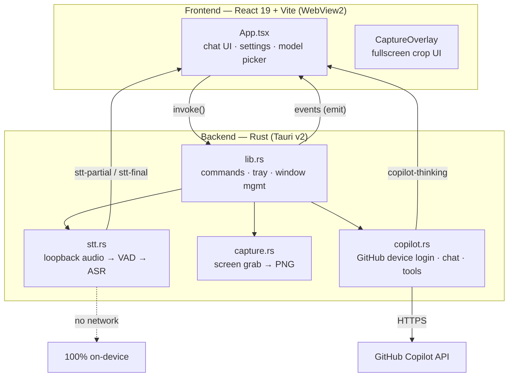
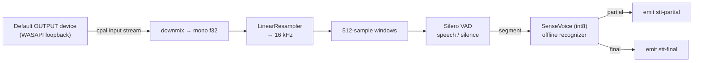
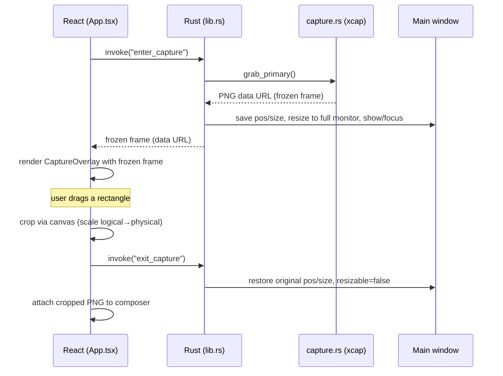

# wg — a stealth desktop AI overlay

`wg` is a tiny, always‑on‑top desktop widget that puts GitHub Copilot chat,
**local** speech‑to‑text, and an **on‑screen region capture** behind a single
frameless window that is **excluded from screen sharing and screenshots**.

It is built with **Tauri v2** (Rust backend + WebView2 frontend), **React 19 +
Vite**, and a fully offline audio pipeline (`sherpa-onnx` + Silero VAD +
SenseVoice). No audio ever leaves the machine; only the chat text/images you
send go to Copilot.

---

## Table of contents

- [High‑level architecture](#high-level-architecture)
- [The window: stealth &amp; content protection](#the-window-stealth--content-protection)
- [Audio system (local speech‑to‑text)](#audio-system-local-speech-to-text)
- [Screenshot / region‑capture technique](#screenshot--region-capture-technique)
- [Copilot chat backend](#copilot-chat-backend)
- [Project layout](#project-layout)
- [Build &amp; run](#build--run)

---

## High‑level architecture



Two directions of communication:

- **Frontend → backend**: `invoke("command_name", args)` calls the
  `#[tauri::command]` functions registered in [`src-tauri/src/lib.rs`](src-tauri/src/lib.rs).
- **Backend → frontend**: `app.emit("event", payload)` streams async updates
  (transcripts, tool “thinking” lines) that the UI subscribes to with
  `listen("event", ...)`.

---

## The window: stealth & content protection

Everything hangs off a **single** window configured in
[`src-tauri/tauri.conf.json`](src-tauri/tauri.conf.json):

| Setting | Value | Why |
| --- | --- | --- |
| `decorations` | `false` | Frameless — custom title bar in React. |
| `transparent` | `true` | Rounded, blurred, floating look. |
| `alwaysOnTop` | `true` | Stays above other apps. |
| `skipTaskbar` | `true` | Invisible in the taskbar / Alt‑Tab; reached via the tray icon. |
| `contentProtected` | `true` | **Excluded from capture** (see below). |
| `resizable` | `false` | Fixed 800×600 widget (toggled programmatically during capture). |

**Content protection** is the core stealth feature. On Windows, Tauri sets
`WDA_EXCLUDEFROMCAPTURE` on the window, so it is omitted from
`getDisplayMedia`, OBS, Zoom/Teams screen share, and OS screenshots — the rest
of the desktop is captured normally, but the widget renders black/absent to any
recorder. It is set both declaratively (`contentProtected: true`) and enforced
again at runtime in `setup()`:

```rust
if let Some(window) = app.get_webview_window("main") {
    let _ = window.set_content_protected(true);
}
```

Because there is only one window and it is content‑protected, **the capture
overlay inherits the same protection for free** (see the screenshot section).

The app has **no taskbar presence**; it is controlled by a **tray icon**
([`lib.rs`](src-tauri/src/lib.rs) `TrayIconBuilder`): left‑click toggles
show/hide, and the menu offers *Show / Hide* and *Quit*.

---

## Audio system (local speech‑to‑text)

All speech‑to‑text is **fully offline and on‑device**. Implemented in
[`src-tauri/src/stt.rs`](src-tauri/src/stt.rs).

### What it captures

On Windows, opening an **input stream on the default *output* device** performs
**WASAPI loopback** — i.e. it records **the system audio you hear** (a meeting,
a video, a call), *not* your microphone. This is what makes it useful for
transcribing whatever is playing on screen.

### The pipeline



Step by step:

1. **Capture** — `cpal` opens the output device for loopback. The callback
   handles `F32`/`I16`/`U16` sample formats and **downmixes** interleaved
   frames to mono, forwarding buffers over an `mpsc` channel.
2. **Resample** — sherpa‑onnx’s `LinearResampler` converts the device rate
   (e.g. 44.1/48 kHz) to the **16 kHz** the models expect.
3. **Segment (VAD)** — audio is fed to **Silero VAD** in fixed **512‑sample**
   windows (the size the model requires). VAD decides where speech starts/ends
   with tuned thresholds (`threshold 0.5`, `min_silence 0.25s`,
   `min_speech 0.25s`, `max_speech 8s`).
4. **Transcribe (ASR)** — each finished segment is decoded by an **offline
   SenseVoice** recognizer (`model.int8.onnx`, language `auto`, ITN on). A
   bounded tail of the ongoing utterance is decoded periodically to produce
   **live partials**.
5. **Stream results** — text is pushed to the UI via Tauri events.

### Threading & robustness

- A single long‑lived **worker thread** owns the recognizer, VAD and audio
  stream — all expensive to construct — so models load **once**, lazily on the
  first `start_stt`. It parks on a command channel between sessions.
- Each session runs inside `catch_unwind`, so a decode panic **emits an error
  and resets the engine** instead of killing the thread (which would hang the
  UI). On stop, trailing buffered speech is flushed so nothing is dropped
  mid‑sentence.
- Shared `AtomicBool` (`recording`) gates the loop; `start`/`stop`/`is_recording`
  are exposed as commands.

### Events the UI listens for

| Event | Meaning |
| --- | --- |
| `stt-status` | `"loading"` \| `"listening"` \| `"stopped"` |
| `stt-partial` | interim transcript for the current utterance |
| `stt-final` | a completed utterance |
| `stt-error` | human‑readable error string |

### Models

Loaded from a bundled `models/` directory (a Tauri **resource**, falling back to
the working dir in dev):

```
models/
  sense-voice/model.int8.onnx   # offline ASR
  sense-voice/tokens.txt
  silero_vad.onnx               # voice activity detection
```

If any file is missing, `stt.rs` returns a clear error telling you to fetch the
models first.

---

## Screenshot / region‑capture technique

Goal: let the user **drag a rectangle over the live screen**, crop it, and
attach it to the chat as an image — **while the widget itself stays hidden from
any recording**.

### Why not a second window?

The obvious approach (spawn a second fullscreen WebView2 window for the
selector) proved **unreliable on the target machine**: the runtime‑created
webview rendered as a solid white, input‑swallowing block and never painted its
page. So `wg` takes a different, robust route.

### The approach: reuse the (content‑protected) main window

The **same main window** — the one that already renders correctly *and* is
content‑protected — is temporarily expanded into a fullscreen overlay, then
restored. Because it is the protected window, **the overlay is automatically
excluded from screen share/recording**.



### Backend: freeze the screen (`enter_capture`)

In [`lib.rs`](src-tauri/src/lib.rs):

1. **Grab the primary monitor** with `capture::grab_primary()` →
   [`capture.rs`](src-tauri/src/capture.rs) uses **`xcap`** to
   `capture_image()` the primary monitor, then encodes it to **PNG** (`png`
   crate) and **base64** into a `data:image/png;base64,…` URL. The widget is
   content‑protected, so **it never appears in the grabbed frame**.
2. **Save** the main window’s current `outer_position()` + `inner_size()` in
   `SavedBounds` state.
3. **Expand** the window to cover the whole primary monitor
   (`set_position`/`set_size` to the monitor’s position/size), toggling
   `set_resizable(true)` so the programmatic resize isn’t blocked, then
   `show()` + `set_focus()`.
4. Return the frozen‑frame data URL to the frontend.

### Frontend: crop the region (`CaptureOverlay`)

The React `CaptureOverlay` component in [`src/App.tsx`](src/App.tsx) renders the
frozen frame full‑screen and lets the user **drag a selection rectangle** (with
a dimming mask + highlighted box). On mouse‑up it crops using an off‑screen
`canvas`:

```ts
// Map CSS (logical) pixels to the frame's native (physical) pixels.
const scaleX = img.naturalWidth / window.innerWidth;
const scaleY = img.naturalHeight / window.innerHeight;
ctx.drawImage(img, cx, cy, cw, ch, 0, 0, cw, ch);
onDone(canvas.toDataURL("image/png"));
```

The **scale factor** matters: after the window is fullscreen,
`window.innerWidth` is the *logical* monitor width while `naturalWidth` is the
*physical* pixel width, so `physical / logical` = the device scale factor —
mapping the CSS‑pixel selection correctly onto the physical‑pixel frame (crisp
crops on HiDPI displays).

- **Esc** or **right‑click** cancels.
- Cropped PNG is set as the composer **attachment** (thumbnail preview with a
  remove button) and can be sent to any **vision‑capable** model (e.g.
  `gpt-4o`).

### Backend: restore (`exit_capture`)

Reads back `SavedBounds` and restores the window’s original size/position, then
sets `resizable(false)` again — the widget snaps back to its 800×600 form.

> v1 captures the **primary monitor** only.

---

## Copilot chat backend

Implemented in [`src-tauri/src/copilot.rs`](src-tauri/src/copilot.rs).

- **Auth** — GitHub **device‑login flow**: `copilot_login_start` returns a user
  code + verification URL; `copilot_login_poll` polls until the OAuth token is
  issued. That token is exchanged for a short‑lived **Copilot API token**
  (cached until expiry).
- **Models** — `copilot_models` lists chat‑capable models for the account and
  records each model’s **supported endpoints**.
- **Chat** — `ask_copilot` routes to the correct API shape per model: most use
  **`/chat/completions`**; newer families (grok, gpt‑5 codex) are served on
  **`/responses`**. Both shapes support the same **tools**:
  - `fetch_url` — fetch readable text of a public web page.
  - `github_get` — read‑only GitHub REST GETs for the signed‑in user.
- **Streaming “thinking”** — while tools run, the backend emits
  `copilot-thinking` lines the UI shows as reasoning steps.
- **Vision** — image attachments (from region capture) are sent as
  `image_url` content parts alongside the text prompt.

---

## Project layout

```
wg/
├─ index.html
├─ package.json            # React 19 + Vite 8 + Tailwind v4 + shadcn/ui
├─ vite.config.ts
├─ src/
│  ├─ App.tsx              # entire UI: chat, settings, model picker, CaptureOverlay
│  ├─ components/ui/       # shadcn/ui primitives (button, input, select, switch, …)
│  └─ lib/utils.ts
├─ src-tauri/
│  ├─ tauri.conf.json      # window (content-protected, frameless, on-top), bundle
│  ├─ Cargo.toml           # tauri, cpal, sherpa-onnx, xcap, png, base64, reqwest
│  ├─ capabilities/        # Tauri command permissions
│  └─ src/
│     ├─ lib.rs            # commands, tray, capture window mgmt, app setup
│     ├─ stt.rs            # local loopback STT (VAD + SenseVoice)
│     ├─ capture.rs        # primary-monitor grab → PNG data URL (xcap)
│     └─ copilot.rs        # GitHub device login, chat routing, tools
└─ models/                 # bundled offline speech models (resource)
```

### Key crates

| Crate | Role |
| --- | --- |
| `tauri` (+ `tray-icon`) | App shell, window, tray, IPC |
| `cpal` | Cross‑platform audio capture (WASAPI loopback) |
| `sherpa-onnx` | Silero VAD + offline SenseVoice ASR |
| `xcap` | Screen/monitor capture |
| `png`, `base64` | Encode frames to a data URL |
| `reqwest` (rustls) | HTTPS to the Copilot/GitHub APIs |

---

## Build & run

Prerequisites: **Node + pnpm**, **Rust toolchain**, and Tauri’s platform
prerequisites (WebView2 on Windows). Place the speech models under `models/`.

```powershell
# install JS deps
pnpm install

# run in dev (Vite on http://localhost:1420 + Rust hot-rebuild)
pnpm tauri dev

# production build
pnpm tauri build
```

Notes:

- Frontend (TypeScript) changes hot‑reload; Rust / `tauri.conf.json` / `Cargo.toml`
  changes trigger a rebuild.
- Closing the widget window during a dev rebuild can surface exit codes like
  `4294967295` / `0xc000013a` — that’s the normal “process was terminated”, not
  a real failure.
- The app has no taskbar icon — use the **tray icon** (left‑click to toggle) to
  show/hide it.

## Recommended IDE Setup

- [VS Code](https://code.visualstudio.com/) + [Tauri](https://marketplace.visualstudio.com/items?itemName=tauri-apps.tauri-vscode) + [rust-analyzer](https://marketplace.visualstudio.com/items?itemName=rust-lang.rust-analyzer)
